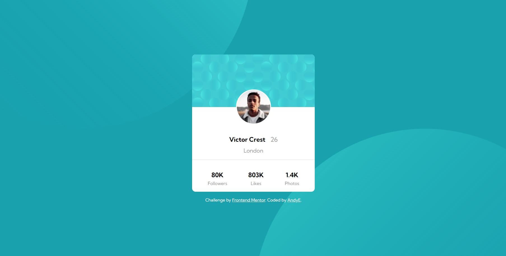

# Frontend Mentor - Profile card component solution

This is a solution to the [Profile card component challenge on Frontend Mentor](https://www.frontendmentor.io/challenges/profile-card-component-cfArpWshJ). Frontend Mentor challenges help you improve your coding skills by building realistic projects. 

## Table of contents

- [Overview](#overview)
  - [The challenge](#the-challenge)
  - [Screenshot](#screenshot)
  - [Links](#links)
- [My process](#my-process)
  - [Built with](#built-with)
  - [What I learned](#what-i-learned)
  - [Continued development](#continued-development)
  - [Useful resources](#useful-resources)
- [Author](#author)

## Overview

### The challenge

- Build out the project to the designs provided

### Screenshot

### Links

- FrontendMentor Site URL: [Frontend Mentor Profile Card Component](https://www.frontendmentor.io/solutions/profile-card-component-7ozEhOGR6i)
- Live Site URL: [Live Profile Card Component](https://radiant-blini-3eafef.netlify.app/profile-card-component/)

## My process

### Built with

- Semantic HTML5 markup
- CSS custom properties
- Flexbox
- Mobile-first workflow

### What I learned

* Using Google Fonts
* multiple background images

### Continued development

* Flexbox
* multiple background images

### Useful resources

These links helped me with multiple backgrounds:
[CSS-Tricks - CSS Basics: Using Multiple Backgrounds](https://css-tricks.com/css-basics-using-multiple-backgrounds/)
[MDN - Using multiple backgrounds](https://developer.mozilla.org/en-US/docs/Web/CSS/CSS_backgrounds_and_borders/Using_multiple_backgrounds)

## Author

- Frontend Mentor - [@bv-andrease](https://www.frontendmentor.io/profile/bv-andrease)
